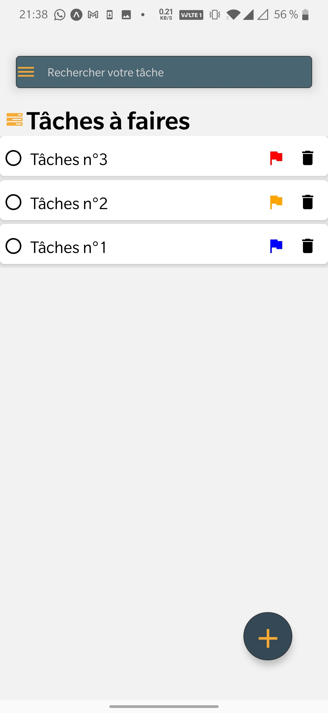
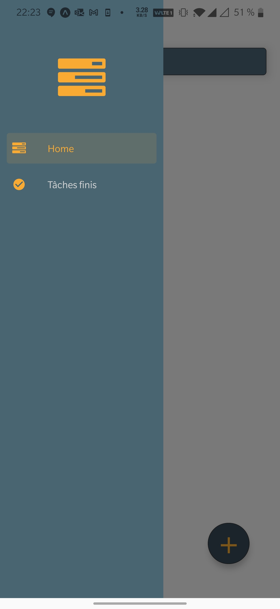
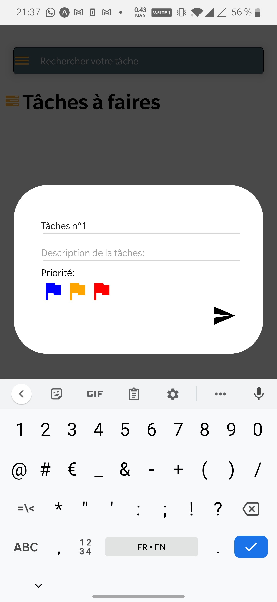
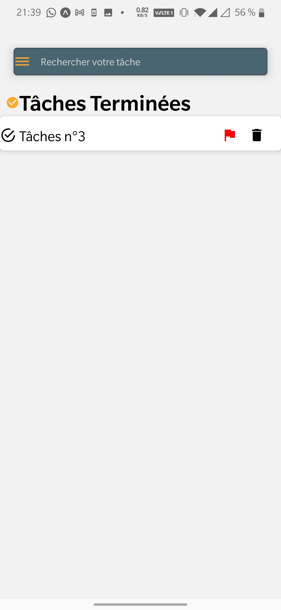

# Application Mobile TodoList
Cette application mobile permet de se faire une liste de tâche adéquate à votre besoin.
<div>

</div>
## Installation de l'application:

* Allez sur le github: https://github.com/doninj/ToDoList
* faite un **git pull** pour récuperer le dossier de l'application.
* Faites dans le projet:  ``` yarn install ``
* Faites un ```yarn android ``` pour lancer le projet.

## Fonctionnement de l'application:

Dans cette application: nous avons deux sections: tâches à faire et tâche terminer. 



### Page tâche à faire:

<div flex="1">




</div>

Dans la page de tâche à faire, il est possible:
* _d'ajouter une tâche avec un titre, une description et une priorité(facultatif). Il y a 3 priorités: **Faible,Moyen,Haute**. La liste est trié par la priorité la plus forte._
* _Faire une recherche de la tâche que l'on veut avec la barre de recherche._
* _Regarder le contenu de la tâche en cliquant dessus._
* _supprimer la tâche que l'on veut avec l'icon de la poubelle._
* _Cocher la tâche pour la mettre dans la section terminer._
* _Retrouver vos tâches lorsque que l'application est éteinte avec un stockage des données._

Pour ajouter une tâche, appuyer sur le bouton +. Cela va afficher un modal qui va permettre d'ajouter une tâche.
### Page tâche terminer:
<div flex="1">

</div>

* _Faire une recherche de la tâche que l'on veut avec la barre de recherche._
* _Regarder le contenu de la tâche en cliquant dessus._
* _supprimer la tâche que l'on veut avec l'icon de la poubelle._
* _Cocher la tâche pour la remettre dans la section à faire._


  


